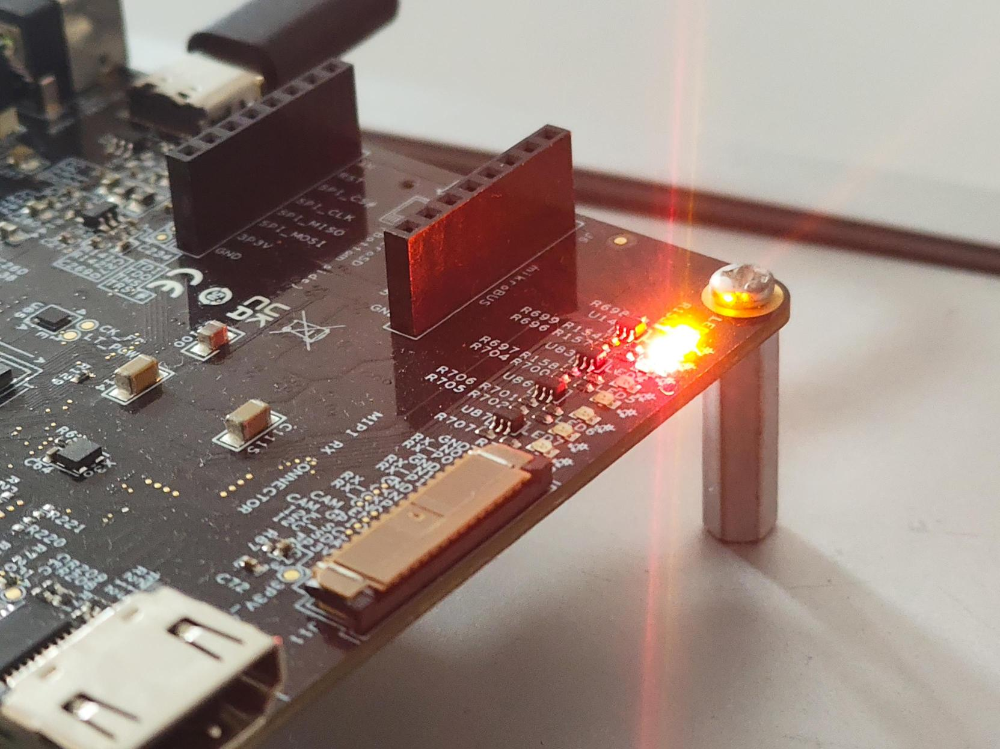

# A simple linux driver
A simple GPIO LED driver with some cool technical terms.
## List of what I know
- Nothing
- Absolutely nothing
- Nothing phone 3A

## Objective
A file should be created in the userspace. whenever a user writes a byte, LEDs of that bits will be on or off. also if user tries to read, he will get a byte with the led states back. You noticed the complexity right?. That is just to piss of whomever going to use this shit driver. f*ck off.

## A short word about the internals
- PIC64GX already have a device tree and nodes for GPIOs.
- We have to get the register addresses and offsets required for manipulating register values.
- In pic64gx1000, GPIOs are divided into different banks to save the world.
- We just have to find which bank these LEDs are mapped and access that GPIO node.

## What file operations our driver should implement.
- An ```open``` function which will check for multiple access and deny if file already in use. This will also create a state machine for leds and initialize all leds to off and set all GPIOs as output.
- A ```read``` function that will give a byte with led states with MSB representing index 1.
- A ```write``` function that takes 1-8 as ascii (or a byte to reperesent all 8 leds together later) and toggle that led.

## Things to learn
- What the device tree will give me and what else should I calculate.
- How do I access the details said in the device tree.
- Once I get the register address, How do I write something into the registers
- How do I get a file as an interface for my driver
- And a C library for easy use of my nowhere complicated driver (who asked?).

## The device tree
When a kernel packed into fitImage, the device tree blob (dtb) is embedded into the fitimage. This blob is created by multiple device tree files in the kernel source code. We have to be familiar with two types of device tree files. ```.dts``` files and ```.dtsi``` files. dtsi file is an overall picture. dts file kind of overwrites it. Here is the dtsi file and dts file for GPIO in PIC64GX1000.

```dtsi
		gpio0: gpio@20120000 {
			compatible = "microchip,pic64gx-gpio", "microchip,mpfs-gpio";
			reg = <0x0 0x20120000 0x0 0x1000>;
			interrupt-parent = <&irqmux>;
			interrupt-controller;
			#interrupt-cells = <2>;
			interrupts = <0>, <1>, <2>, <3>,
				     <4>, <5>, <6>, <7>,
				     <8>, <9>, <10>, <11>,
				     <12>, <13>;
			clocks = <&clkcfg CLK_GPIO0>;
			gpio-controller;
			#gpio-cells = <2>;
			ngpios = <14>;
			status = "disabled";
		};

		gpio1: gpio@20121000 {
			compatible = "microchip,pic64gx-gpio", "microchip,mpfs-gpio";
			reg = <0x0 0x20121000 0x0 0x1000>;
			interrupt-parent = <&irqmux>;
			interrupt-controller;
			#interrupt-cells = <2>;
			interrupts = <32>, <33>, <34>, <35>,
				     <36>, <37>, <38>, <39>,
				     <40>, <41>, <42>, <43>,
				     <44>, <45>, <46>, <47>,
				     <48>, <49>, <50>, <51>,
				     <52>, <53>, <54>, <55>;
			clocks = <&clkcfg CLK_GPIO1>;
			gpio-controller;
			#gpio-cells = <2>;
			ngpios = <24>;
			status = "disabled";
		};

		gpio2: gpio@20122000 {
			compatible = "microchip,pic64gx-gpio", "microchip,mpfs-gpio";
			reg = <0x0 0x20122000 0x0 0x1000>;
			interrupt-parent = <&irqmux>;
			interrupt-controller;
			#interrupt-cells = <2>;
			interrupts = <64>, <65>, <66>, <67>,
				     <68>, <69>, <70>, <71>,
				     <72>, <73>, <74>, <75>,
				     <76>, <77>, <78>, <79>,
				     <80>, <81>, <82>, <83>,
				     <84>, <85>, <86>, <87>,
				     <88>, <89>, <90>, <91>,
				     <92>, <93>, <94>, <95>;
			clocks = <&clkcfg CLK_GPIO2>;
			gpio-controller;
			#gpio-cells = <2>;
			ngpios = <32>;
			status = "disabled";
		};
```

And here is the corresponding dts file
```dts
&gpio0 {
	status ="okay";
	gpio-line-names =
		"", "", "", "", "", "", "", "",
		"", "", "", "", "MIPI_CAM_RESET", "MIPI_CAM_STANDBY";
};

&gpio1 {
	status ="okay";
	gpio-line-names =
		"", "", "LED1", "LED2", "LED3", "LED4", "LED5", "LED6",
		"LED7", "LED8", "", "", "", "", "", "",
		"", "", "", "", "HDMI_HPD", "", "", "GPIO_1_23";
};

&gpio2 {
	pinctrl-names = "default";
	pinctrl-0 = <&mdio1_gpio>, <&spi0_gpio>, <&can0_gpio>, <&pcie_gpio>,
		    <&qspi_gpio>, <&uart3_gpio>, <&uart4_gpio>, <&can1_gpio>;
	status ="okay";
	gpio-line-names =
		"", "", "", "", "", "", "SWITCH2", "USR_IO12",
		"DIP1", "DIP2", "", "DIP3", "USR_IO1", "USR_IO2", "USR_IO7", "USR_IO8",
		"USR_IO3", "USR_IO4", "USR_IO5", "USR_IO6", "", "", "USR_IO9", "USR_IO10",
		"DIP4", "USR_IO11", "", "", "SWITCH1", "", "", "";
};
```

You can see that dtsi contains all the necessory info and names and status (acts like an enable) for each GPIO. From here itself we can see that the GPIO LEDs are connected into gpio1. If you are not sure check this link
[GPIO LED mapping PIC64GX1000](https://developerhelp.microchip.com/xwiki/bin/view/products/mcu-mpu/64bit-mpu/pic64-applications-gpio/)

Here we are intrested in these 3 lines
```dts
        ...
		gpio1: gpio@20121000 {
			compatible = "microchip,pic64gx-gpio", "microchip,mpfs-gpio";
			reg = <0x0 0x20121000 0x0 0x1000>;
        ...
```
We got the node name, the compatiblity string and where the register address, offset, and size is saved. Node name is simply node name. The compatiblity string is used to identify a device node by the device driver. Our driver is going to identify the device tree entry using this string and node name. Now the reg variable, ```0x20121000``` is the base address and ```0x0``` is the offset and ```0x1000``` is the size of region for that GPIO bank. You may say we can hardcode this into our code and get rid of the device tree. If you do that, you'll be added to the naughty list of santa clause. And also your driver will not be portable to another device with another register mapping. So please don't do that.

Now we can tackle the device tree part. for that we will write a helloworld driver and try to get the register address and print it in the dmsgs. By the way here is a helloworld driver I stole from ['Linux Device Drivers'](https://lwn.net/Kernel/LDD3/) book. I reffered a lot from this book. great book from 2002.
```c
#include <linux/init.h>
#include <linux/module.h>

MODULE_LICENSE("Dual BSD/GPL");

static int hello_init(void) {
    printk(KERN_ALERT "Hello, world\n");
    return 0;
}
static void hello_exit(void) {
    printk(KERN_ALERT "Goodbye, cruel world\n");
}

module_init(hello_init);
module_exit(hello_exit);
```
Here we are defining two functions to call when the module is getting loaded. If you like to hear about this more about from me check [This article](https://vijaysatheesh.github.io/journal/viewer.html?file=notes%2FLinux%20Driver.md).

For finding the device tree node, there are two approaches. One is the preffered one to use the platform device API provided by linux. For this we only need to know the compatiblity string and this API will fetch the node for us.

The another method is the manual lookup using the ```of.h``` library. For this we need to know the exact path of the device tree. This approach is not that much portable. But we will use this method first and will later port the device tree lookup to use platform device API.

```c
#include <linux/init.h>
#include <linux/module.h>
#include <linux/of.h>

MODULE_LICENSE("Dual BSD/GPL");

static void * hw_base;

static int led_driver_init(void) {
    struct device_node * np;
    u32 value[4];
    np = of_find_node_by_path("/soc/gpio@20121000");
    if(!np){
        pr_err("ERR:Cannot find node in device tree!!");
        return -ENODEV;
    }
    if(of_property_read_u32_array(np,"reg",value,4) == 0){
        pr_info("INFO:Value read from reg:%x,%x,%x,%x",value[0],value[1],value[2],value[3]);
    }else{
        pr_err("ERR:Cannot read node!!");
        return -ENODEV;
    }

    return 0;
}
static void led_driver_exit(void) {
	release_mem_region(value[1],value[3]);
    printk(KERN_ALERT "Goodbye, best world\n");
}

module_init(led_driver_init);
module_exit(led_driver_exit);
```

Here we will find the node using the path of that node. Alternatively we what we can do is to use the compatable string. 
```c
np = of_find_node_by_path("/soc/gpio@20121000");
```
will be replaced by:
```c
np = of_find_compatible_node(NULL,NULL,"vijay,mpfs-gpio");
```
First parameter is the ```root``` which is here the system root, so left ```NULL```. Next is the node type that also left ```NULL```. Third is obviously the compatablity string.

Also for this to work I added my own node to the device tree. This way I can generalize the driver and specify other control register addresses in the device tree.

```dts
led: led@20121000 {
        compatible = "vijay,pic64gx-gpio", "vijay,mpfs-gpio";
        reg = <0x0 0x20121000 0x0 0x1000>;
        status = "okay";
};
```

Another thing is if you want to read or write a register inside the GPIO controller inside SOC, we need to enable the subsystem clock to that controller and release the soft reset of that controller. For this we need to write into two registers. ```SUBBLK_CLOCK_CR``` for clock and ```SOFT_RESET_CR``` for reset. By reffering to the register map we get the base address and which bit to write
- 0x2000 2088 : SOFT_RESET_CR bit 21 is GPIO
- 0x2000 2084 : SUBBLK_CLOCK_CR bit 21 is GPIO

So we want to set the 21'st bit of SUBBLK_CLOCK_CR, we have to OR the value of that register with 
```00000000001000000000000000000000 = 0x200000```
Similiarly we want to clear the 21st bit in SOFT_RESET_CR
```oldvalue OR ~0x200000``` 

## The register lookup function

I wrote a function which takes the compatablity string and sets up all the registers and access to them for us.
```c
#define SUBB_CLK_REG    0x20002084
#define SOFT_RESET_REG  0x20002088

#define BASE_INDEX 1
#define SIZE_INDEX 3

u32 value[4];

int led_register_lookup(const char * tree_name){
    struct device_node * np;
    np = of_find_compatible_node(NULL,NULL,tree_name);
    if(!np){
        pr_err("ERR:Cannot find node in device tree!!");
        return -ENODEV;
    }
    if(of_property_read_u32_array(np,"reg",value,4) == 0){
        pr_alert("INFO:Value read from reg:%x,%x,%x,%x",value[0],value[BASE_INDEX],value[2],value[SIZE_INDEX]);
    }else{
        pr_err("ERR:Cannot read node!!");
        return -ENODEV;
    }
    
    if(!request_mem_region(value[BASE_INDEX],value[SIZE_INDEX],"fancyled")){
        pr_err("ERR:Access to GPIO register space failed!!");
        return -EBUSY;
    }

    if(!request_mem_region(SOFT_RESET_REG,4,"fancyled")){
        pr_err("ERR:Access to GPIO Reset register space failed!!");
        return -EBUSY;
    }

    if(!request_mem_region(SUBB_CLK_REG,4,"fancyled")){
        pr_err("ERR:Access to GPIO Clock register space failed!!");
        return -EBUSY;
    }
    return 0;
}
```

The rest of the code from previous block is to request the kernel for the access of the region we found from the device tree. We take all the space specified in the device tree and for the clock and reset registers we take 4byte (32 bits) access.

## The register init function
```c
static char __iomem * hw_base;
static char __iomem * hw_clock;
static char __iomem * hw_reset;

int led_register_init(){
    hw_base = ioremap(value[BASE_INDEX],value[SIZE_INDEX]);
    hw_clock = ioremap(SUBB_CLK_REG,4);
    hw_reset = ioremap(SOFT_RESET_REG,4);

	if (!hw_clock)
    {
        pr_err("ERR:Cannot map to virtual memory!!");
        release_mem_region(SUBB_CLK_REG,4);
        return -EBUSY;
    }

    if (!hw_reset)
    {
        pr_err("ERR:Cannot map to virtual memory!!");
        release_mem_region(SOFT_RESET_REG,4);
        return -EBUSY;
    }

    if (!hw_base)
    {
        pr_err("ERR:Cannot map to virtual memory!!");
        release_mem_region(value[BASE_INDEX],value[SIZE_INDEX]);
        return -EBUSY;
    }
	...
```
Here we are mapping the physical memory of the registers to the virtual memory that we can access using ```ioremap()``` function. After that we will check for any null pointer errors and handle it.
```c
	...
	u32 orig_clock_state = ioread32(hw_clock);
    u32 orig_reset_state = ioread32(hw_reset);
    pr_info("INFO:Clock and reset values  %x %x ...",orig_clock_state,orig_reset_state);
    iowrite32( orig_clock_state | 0x200000,hw_clock);
    iowrite32( orig_reset_state & ~0x200000,hw_reset);
	...
```
As mentioned earlier we have to enable the clock and deassert the reset for the GPIO bank 1. For this we will take the original states of these registers,modify and rewrite.
```c
	...
    iowrite32(0x5,hw_base + 0x8);
    iowrite32(0x5,hw_base + 0xC);
    iowrite32(0x5,hw_base + 0x10);
    iowrite32(0x5,hw_base + 0x14);
    iowrite32(0x5,hw_base + 0x18);
    iowrite32(0x5,hw_base + 0x1C);
    iowrite32(0x5,hw_base + 0x20);
    iowrite32(0x5,hw_base + 0x24);

	    pr_info("Init values written successfully...");
    led_register_byte_write(0xFF);
    u8 readback;
    led_register_byte_read(&readback);
    pr_info("Test values write=%d read=%d",0xFF,readback);
    led_register_byte_write(0x00);
    return 0;
}

```
A 32 bit config register is present for all GPIOs. We are intrested in 8 of them. For enabling a GPIO as output, we have to set the third and first bits.
- Bit 0: Direction - 0 for input,1 for output
- Bit 2: Output buffer enable
Writing 0x5(0b101) will do this. After that we'll wrap up the function with a small self test.

## The register read/wrte function
```c
void led_register_byte_write(u8 byte){
    u16 dbyte = byte;
    iowrite32(dbyte << 2,hw_base + 0xA4);
    iowrite32(~(dbyte << 2),hw_base + 0xA0);
}

void led_register_byte_read(u8 * byte){
    u32 val = ioread32(hw_base + 0x88);
    *byte = (u8)(val >> 2);
}
```
For writing, we have to write the 32 bits of corresponding GPIOs located in the SET_BITS register. We are taking a byte to set for all 8 leds. Because of the leds are mapped with an offset of 2 in the GPIO bank, we have to right shift the byte by 2. And we are giving it's inverse to the CLEAR_BITS register. For reading back we are reading values from the GPOUT register because the SET_BITS register is write only.

## The register deinit function
```c
void led_register_deinit(){
    led_register_byte_write(0x00);
    if(hw_base){
        iounmap(hw_base);
    }
    if(hw_clock){
        iounmap(hw_clock);
    }
    if(hw_reset){
        iounmap(hw_reset);
    }
    release_mem_region(value[BASE_INDEX],value[SIZE_INDEX]);
    release_mem_region(SUBB_CLK_REG,4);
    release_mem_region(SOFT_RESET_REG,4);
}
```
Nothiing special. We're just giving back what we took. Like a gentleman.

## About the user space interface
For communicating with this driver, we'll create a charecter driver. If you dom't know what it is, You can refer [This article](https://vijaysatheesh.github.io/journal/viewer.html?file=notes%2FLinux%20Driver.md). Before that we have to understand these concepts.
- class
	- In this context, device class is a group contains all similiar devices. This is for the udev in linux to manage devices easily. This class will contain all the info about the devices within that class.
- device
	- This is a file. Not just any file but a file where the module can communicate. Anything we write to this will be recieved by the module. And we can write back through this file. A class can contain multiplle devices. This can be a charecter device, a block device or a network device.
- File operations
	- This is simply the possible operations applied to the device. For more refer the article.
- Major and minor numbers
	- An index used by the kernel to identify the driver and device. Major number should be allocated by the system (best practice) and minor numbers we can chose 

## The module_init function
first we will declare some structs

```c
dev_t devno; // To hold minor and major numbers
unsigned int baseminor = 0; // First minor number
unsigned int baseminorcount = 1; // Number of devices we want
struct cdev led_cdev; // c_dev struct containing info about a charecter device
struct file_operations led_fops; // Holds all function pointers of file operation callbacks
struct class* led_class; // Struct defining a class
struct device* led_device; // Struct defining a device
```

In this function we will:
- allocate the minor number and major number
- populate the cdev struct
- create a class
- create a device within that class with devno we got while allocating.
- After the device creation we will assign the file operation function pointers to the file_operations struct.

Here is the full code:
```c
#include <linux/fs.h>
#include <linux/cdev.h>
#include <linux/moduleparam.h>
#include <linux/printk.h>
#include "led_register.h"

ssize_t read(struct file * ,char * , size_t, loff_t *);
ssize_t write(struct file *, const char __user *, size_t, loff_t *);
int open(struct inode *, struct file *);


MODULE_DESCRIPTION("A simple driver for learning");
MODULE_LICENSE("GPL");  // Specify license
MODULE_AUTHOR("Vijay Satheesh");

dev_t devno;
unsigned int baseminor = 0;
unsigned int baseminorcount = 1;
struct cdev led_cdev;
struct file_operations led_fops;
struct class* led_class;
struct device* led_device;

static int led_driver_init(void) {
    int result =led_register_lookup("vijay,mpfs-gpio");
    if(result<0) {
        return result;
    }
    led_register_init();

    pr_notice("Fancy LED driver: chrdev registration started.\n");

    result = alloc_chrdev_region(&devno, baseminor, baseminorcount, "led");

    if (result < 0) {
        pr_err("Fancy LED driver: chrdev registration failed. %d\n", result);
        goto err_out;
    } else {
        pr_notice("Fancy LED driver: chrdev registration finished.%d\n", result);
    }

    cdev_init(&led_cdev, &led_fops);
    led_cdev.owner = THIS_MODULE;
    result = cdev_add(&led_cdev, devno, baseminorcount);

    if (result < 0) {
        pr_err("Fancy LED driver: cdev registration failed. %d\n", result);
        goto err_unregister_chrdev_region;
    } else {
        pr_notice("Fancy LED driver: cdev registration finished.%d\n", result);
    }

    led_class = class_create("led");
    if (IS_ERR(led_class)) {
        result = PTR_ERR(led_class);
        pr_err("Fancy LED driver: class_create failed: %d\n", result);
        goto err_cdev_del;
    } else {
        pr_notice("Fancy LED driver: class create finished.%d\n", result);
    }

    led_device = device_create(led_class, NULL, devno, NULL, "led");
    if (IS_ERR(led_device)) {
        result = PTR_ERR(led_device);
        pr_err("Fancy LED driver: device create failed: %d\n", result);
        goto err_class_destroy;
    } else {
        pr_notice("Fancy LED driver: device create finished.%d\n", result);
        led_fops.read = read;
        led_fops.write = write;
        led_fops.open = open;
    }
    
    return 0;
err_class_destroy:
    if (!IS_ERR_OR_NULL(led_class)) {
        class_destroy(led_class);
        led_class = NULL;
    }

err_cdev_del:
    cdev_del(&led_cdev);

err_unregister_chrdev_region:
    if (devno) {
        unsigned minor_count_allocated = 1;
        unregister_chrdev_region(devno, minor_count_allocated);
        devno = 0;
    }

err_out:
    return result;
}
```
# The module_exit function
```c
static void led_driver_exit(void) {
    led_register_deinit();
    if (!IS_ERR_OR_NULL(led_device)) {
        device_destroy(led_class,devno);
        led_device = NULL;
    }
    
    if (!IS_ERR_OR_NULL(led_class)) {
        class_destroy(led_class);
        led_class = NULL;
    }

    cdev_del(&led_cdev);

    if (devno) {
        unsigned minor_count_allocated = 1;
        unregister_chrdev_region(devno, minor_count_allocated);
        devno = 0;
    }
    pr_notice("Fancy LED driver: driver deregistered and unloaded.\n");
}
```
Here,we'll undo all the registrations we did in the init. That's it. At this point we can compile and run our driver. For a how to, refer the article.

## The read, write and open function
Since we are reading a byte, the limits are set to 1.This method is called by the VFS (Virtual filesystem). The arguments are:
- ```filep```: A pointer to the file descriptor. contains file info.
- '''buffer''': The user buffer to write to.
- ```len```: Size of the current transaction.
- ```offset```: A pointer to track which byte is currently pointed by the file cursor.

```c
ssize_t read(struct file * filep,char * buffer, size_t len, loff_t * offset){
    pr_notice("Fancy LED driver Read: Someone read data!!");
    u8 byte = 0x0;
    led_register_byte_read(&byte);
    if (*offset >= 1) // Returns 0 if the cursor is out of bound
    {
        return 0;
    }

    if (len > 1) // Make the length in between bounds
    {
        len = 1;
    }

    if (copy_to_user(buffer,&byte,len) != 0) // Safely copy the value to user buffer and check errors
    {
        return -EFAULT;
    }
    
    *offset += len; // Increment the cursor
    return len; // Return the number of charecters read
}
```

Simiiarly we have the write function:
```c
ssize_t write(struct file * filep, const char __user * buffer, size_t len, loff_t * offset){
    u8 byte;
    if (*offset >= 1)
    {
        return 0;
    }

    if (len > 1)
    {
        len = 1;
    }

    if (copy_from_user(&byte,buffer,len) != 0)
    {
        return -EFAULT;
    }
    
    led_register_byte_write(byte);
    *offset += len;
    return len;
}
```

And an open function which do nothing:
```c
int open(struct inode * in, struct file * filp){
    pr_notice("Fancy LED driver: Someone opened a stream.\n");
    return 0;
}
```

## A user code for testing
I also wrote a test code which uses the LEDs as a bar to show the memory usage.
```c
 #include <stdio.h>
#include <stdlib.h>
#include <unistd.h>
#include <stdint.h>
#include <sys/sysinfo.h>

void set_led_byte(char byte);
int mem_usage();

int main(int argc, char const *argv[])
{
    char byte = 0b10000000;
    while(1){
        mem_usage();
        usleep(200000);
        byte = byte>>1;
        if(byte == 0x00) byte = 0b10000000;
    }

    return 0;
}

void set_led_byte(char byte){
    FILE * fp = fopen("/dev/led","wb");
    if(fp == NULL){
        printf("Open Failed!! Make sure the driver is loaded\n");
        exit(1);
    }
    fwrite(&byte,1,1,fp);
    fclose(fp);
};


int mem_usage() {
    struct sysinfo si;

    if (sysinfo(&si) == 0) {
        long long total_ram = (long long)si.totalram * si.mem_unit;
        long long free_ram  = (long long)si.freeram * si.mem_unit;
        long long used_ram  = total_ram - free_ram;
        float percentage_8 = ((double)used_ram / total_ram) * 8;
        char byte = 0;
        set_led_byte(byte);
        for(int i = 0;i<(int)percentage_8 + 1;i++){
            byte = (byte<<1) | 0x1;
        }
        set_led_byte(byte);
        printf("%f\nUsed System RAM:  %lld MB\n",percentage_8, used_ram / (1024 * 1024));
    } else {
        perror("sysinfo error");
        return 1;
    }
    return 0;
}
```
This will take the current memory usage, calculate it's byte to write to regster and write that to ```/dev/led```. Output will look like this.
. The full code can be found in the following repo. Please note down your comments.
[Source code](https://github.com/vijaysatheesh/fancyleddriver.git)