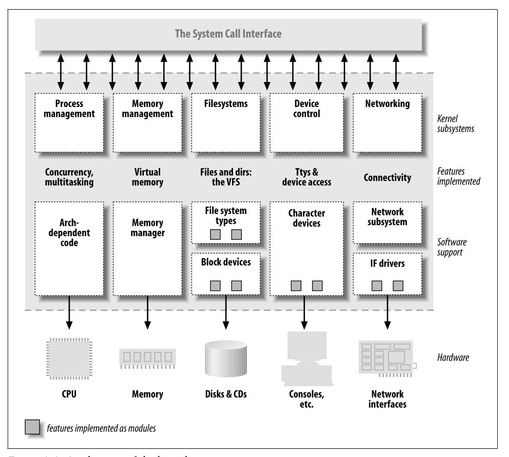

# Linux Drivers

## What is a driver
- Driver is a piece of code that lies inside the kernel space.
- It abstracts the hardware complexities for the system.
- A device driver dont have to watch for the policies. It simply want to translate what the hardware is saying.
    - Eg: A disk driver will not implement policies of access. It will simply convert the hardcoded data into software data blocks.
- This will make a particular driver usable for different devices with diferent use cases and policies.
- Even though it can also abstract some of the software complexities such as byteb read capablity.

## Kernel duties
- Process Management
- Memory Management
- Filesystems
- Device management
- Networking

Kernel is playing balls with these without skipping a beat. Have some respect!!



## Loadable Modules
Unlike peasent windows systems which asks for a reboot even when you breath, Linux can load and unload features from the system while running. These type of drivers are called **modules**. ```insmod``` program is used to load and ```rmmmod``` is used to unload. In the view of linux there are three type of modules. This classification is based on how the user space is communicating with the driver in the kernel space.
- charecter modules
- block modules
- network modules

### Charecter modules
- These modules are accesed byte by byte.
- The device should implement ```open,close,write,read``` system calls minimum for this driver to work.
- These drivers can provide data as streams. Comes with the issue of sequential reading.
- The best example for these are the FTDI drivers. The driver underneath will take care of all the UART hardware complexities and provide the data stream as a charecter file stream located at ```/dev/ttyUSB-MCHP*```. Now any user program like minicom can take that input as files and process them.

### Block modules
- These are differed from charecter modules by how they interacts with the kernel. They can process data as blocks (usually 512 bytes).
- But linux treats them like charecter devices and allow us to write any number of bytes.
- These will also be located in the ```/dev/``` folder.

### Network modules
- These drivers will appear to the user space as network loopback devices.
- Usually stream oriented packet devices.

## Module development API
Thankfully linux provides a good API for developing a module. This is included in the compiler path and accessable within the system. The two header files provides the needed APIs are
    - ```linux/init.h```
    - ```linux/module.h```

### Module entry point
For the entry point we have ```module_init()``` and ```module_exit()``` functions. This will take a function pointer and call that function when a module is ready to be initialized and exited. The function pointer should be a type of:
```c
static int (* callback) (void);
```
Below is a hello world code.
```c
#include <linux/init.h>
#include <linux/module.h>
MODULE_LICESE("GPL");  // Specify license

static int __init my_module_init(void){
    printk(KERN_ALERT "Module is inited\n");
    return 0;
}

static void __exit my_module_exit(void){
    printk(KERN_ALERT "Module is exited\n");
}

module_init(my_module_init);
module_exit(my_module_exit);

```
Here printk is a function provided by module.h to print something in kernel logs. KERN_ALERT is a macro which defines the kernel's prefix for logging and priority.

```__init``` and ```__exit``` tags are used to notify the kernel that these functions are only used at the initialization and cleanup time. So the function will not be loaded full time.

When we are coding inside the kernel space there is no Standard C library support. Even if we can include them, It will not be linked from the kernel. Beware of that. Also the errors in kernel modules are much severe than in application code. It might kill you.

Also unlike the stack of user space programs, kernel space have a very less stack size. So reduce the budget of memory. If you need more memory, dynamically allocate them.

### Compiling a module
The GNU extended make provides the utils for building a module. we just have to mention the object file to an ```obj-m``` variable.

```Makefile
obj-m := mymod.o
```
if you have multiple module under construction,
```Makefile
obj-m := mymod1.o
obj-m += mymod2.o
```
If you are building for the system you were right in, just call ```make``` 

### Building for another device right from the kernel source
If you look at the ```drivers/``` folder in the kernel source, all device drivers are categorised in this folder. For our current simple driver get inside the ```misc/``` folder. Here you can see a lot of ```.c,.o,.ko``` files which are part of various modules. We can copy our C file here for the module.

When we look at the Makfile in that directory we can see something in the format of this
```Makefile
obj-$(CONFIG_NAMEHERE)      += modulename.o
```
This ```CONFIG_NAMEHERE``` variable will be set by the Kconfig program. and if that valye is 'm', make will interpret this as ```obj-m  += modulename.o``` and build it as a module. If it is 'y' it will be built as a built-in driver and if it is 'n' it will be ignored and not built.

After building, the kernels build system will automatically add it to the kernel image.

### Things provided in ```module.h```

|||
|:--|--:|
|MODULE_LICENSE | Used to specify code license|
|MODULE_AUTHOR |Specify the module author|
|MODULE_DESCRIPTION| Describe about the module|
|MODULE_VERSION| Current version of the module|
|MODULE_ALIAS| Another name the module known by|
|MODULE_DEVICE_TABLE| Tell the kernel which devices the module supports|

These declarations can appear anywhere in the code outside a function.

### Registering utilities
In the initialization function, the module should ask for all the needed resources including memory,cpu and other resources from the kernel and register the interfaces described before. This is the driver's buissness. Also in the exit function, the driver should return all the resources and unregister interfaces like a good boy.

### Passing arguments into modules loading
while using ```insmod``` or ```modprobe``` we can load arguments with them. ```moduleparam.h``` provides the functionality for registering parameters. We can use ```module_param``` macro for that.
```c
static char * name = "Vijay";
static int times = 10;
module_param(name,charp,S_IRUGO);
module_param(times,int,S_IRUGO);
```
If no value is given while loading, The variables will be initialized normally. But we can provide value to the variables. Modules also support array parameters seperated by commas.
```bash
sudo insmod mymod.ko name=Satheesh times=5
```
The supported datatypes are:
- bool
- invbool
- charp
- int
- long
- short
- uint
- ushort
- ulong

Hint: S_IRUGO is a permission modifier. will be discussed later. Ippo athra kanda mathi. kooduthal kostyans venda.  

## Char driver
For the sake of learning we'll design a simple memory mapped device.
### Major and minor number
When we use ```ls -la``` command inside ```/dev``` folder, we'll get an output similiar to this.
```bash
drwxr-xr-x   3 root  root            60 Sep 18 08:57 mtd/
crw-------   1 root  root     90,     0 Sep 18 08:57 mtd0
crw-------   1 root  root     90,     1 Sep 18 08:57 mtd0ro
crw-------   1 root  root     90,     2 Sep 18 08:57 mtd1
crw-------   1 root  root     90,     3 Sep 18 08:57 mtd1ro
drwxr-xr-x   2 root  root            60 Sep 18 08:57 net/
crw-------   1 root  root    238,     0 Sep 18 08:57 ng0n1
crw-rw-rw-   1 root  root      1,     3 Sep 18 08:57 null
crw-------   1 root  root    239,     0 Sep 18 08:57 nvme0
brw-rw----   1 root  disk    259,     0 Sep 18 08:57 nvme0n1
brw-rw----   1 root  disk    259,     1 Sep 18 08:58 nvme0n1p1
brw-rw----   1 root  disk    259,     2 Sep 18 08:58 nvme0n1p2
brw-rw----   1 root  disk    259,     3 Sep 18 08:58 nvme0n1p3
brw-rw----   1 root  disk    259,     4 Sep 18 08:58 nvme0n1p4
brw-rw----   1 root  disk    259,     5 Sep 18 08:58 nvme0n1p5
brw-rw----   1 root  disk    259,     6 Sep 18 08:58 nvme0n1p6
brw-rw----   1 root  disk    259,     7 Sep 18 08:58 nvme0n1p7
crw-r-----   1 root  kmem     10,   144 Sep 18 08:57 nvram
```
Here you can see a special letter is appended before eeach device. 'c' denotes a charecter device and 'b' denotes a block device. Also you can see two numbers specified before the modification date. They are called Major number and minor number. Kernel uses these numbers to identify the device and the driver associated with it. Major number refers to the driver and minor number refers to the driver itself. Below is a set of 3 devices from same driver. Notice they have same major number and different minor number.

```bash
crw-rw-rw-+  1 root  dialout 188,     1 Sep 18 09:27 ttyUSB1
crw-rw-rw-+  1 root  dialout 188,     2 Sep 18 09:27 ttyUSB2
crw-rw-rw-+  1 root  dialout 188,     3 Sep 18 09:27 ttyUSB3
```

In the module code itself, we can get the major and minor numbers using a builtin macro. A device type ```dev_t``` datatype defined inside ```linux/types.h``` is passed to a ```MAJOR``` and ```MINOR``` macros.

### Registering a charecter driver
The first task of a charecter driver is to register a device and get a major and minor device. We use ```register_chrdev_region``` function defined inside ```linux/fs.h```.
```c
int register_chrdev_region(dev_t first,unsigned int count,char * name);
```
Here ```first``` is the first major and minor number pair you defined, ```count``` is the number of device you need and ```name``` is the name of the devices. If the number is large it may exceed the major number but everything will work just fine.

The registered device will appear as files inside ```/proc/devices``` and the function will return 0 if allocation is permitted and successfull. 

In this method, we are statically assigning a major number. This may work on your device, but some major numbers are most likely to be used. So a safe bet is to dynamically alocate them. If you want to allocate devices dynamically, you can use function:
```c
int alloc_chrdev_region(dev_t *dev, unsigned int firstminor,unsigned int count, char *name);
```
Here ```* dev_t``` is the pointer to the output device specifier and first minor is the first minor number of the range you want. Everything else is same as above.

Regardless of how you allocated them, you must free a device after your use like a gentleman. Use:
```c
void unregister_chrdev_region(dev_t first, unsigned int count);
```
Conclusively, the best approach is to give an option for specifying major number while loading the driver and if not given, allocate a number dynamically.
```c
if(major) {
    dev = MKDEV(major,minor);
    result = register_chrdev_region(dev,count,"name");
} else {
    result = alloc_chrdev_region(&dev,minor,count,"name");
}
if (result < 0) {
    printk(KERN_WARNING "scull: can't get major %d\n", scull_major);
    return result;
}
```
### File operations
As you can see, everything inside linux is a file. So the way the user-space talks to the kernel-space is also through a file. For a driver, it is it's duty to implement the file operations. for that we have to implement the following file operations atleast. before that, all operations have an owner module, which will be THIS_MODILE most of the case. below variable indicates that. the kernel will never unload that module when that file operation is running.
```c
struct module * owner;
```
```c
loff_t (*llseek) (struct file *, loff_t, int);
```
The llseek method is used to change the current read/write position in a file, and
the new position is returned as a (positive) return value. The loff_t parameter is
a “long offset” and is at least 64 bits wide even on 32-bit platforms. Errors are
signaled by a negative return value. If this function pointer is NULL, seek calls will
modify the position counter in the file structure (described in the section “The
file Structure”) in potentially unpredictable ways.
```c
ssize_t (*read) (struct file *, char __user *, size_t, loff_t *);
```
Used to retrieve data from the device. A null pointer in this position causes the
read system call to fail with -EINVAL (“Invalid argument”). A nonnegative return
value represents the number of bytes successfully read (the return value is a
“signed size” type, usually the native integer type for the target platform).
```c
ssize_t (*aio_read)(struct kiocb *, char __user *, size_t, loff_t);
```
Initiates an asynchronous read—a read operation that might not complete
before the function returns. If this method is NULL, all operations will be pro-
cessed (synchronously) by read instead.
```c
ssize_t (*write) (struct file *, const char __user *, size_t, loff_t *);
```
Sends data to the device. If NULL, -EINVAL is returned to the program calling the
write system call. The return value, if nonnegative, represents the number of
bytes successfully written.
```c
ssize_t (*aio_write)(struct kiocb *, const char __user *, size_t, loff_t *);
```
Initiates an asynchronous write operation on the device.
```c
int (*readdir) (struct file *, void *, filldir_t);
```
This field should be NULL for device files; it is used for reading directories and is
useful only for filesystems.
```c
unsigned int (*poll) (struct file *, struct poll_table_struct *);
```
The poll method is the back end of three system calls: poll, epoll, and select, all of
which are used to query whether a read or write to one or more file descriptors
would block. The poll method should return a bit mask indicating whether non-
blocking reads or writes are possible, and, possibly, provide the kernel with
information that can be used to put the calling process to sleep until I/O
becomes possible. If a driver leaves its poll method NULL, the device is assumed to
be both readable and writable without blocking.
```c
int (*ioctl) (struct inode *, struct file *, unsigned int, unsigned long);
```
The ioctl system call offers a way to issue device-specific commands (such as for-
matting a track of a floppy disk, which is neither reading nor writing). Addition-
ally, a few ioctl commands are recognized by the kernel without referring to the
fops table. If the device doesn’t provide an ioctl method, the system call returns
an error for any request that isn’t predefined (-ENOTTY, “No such ioctl for
device”).
```c
int (*mmap) (struct file *, struct vm_area_struct *);
```
mmap is used to request a mapping of device memory to a process’s address
space. If this method is NULL, the mmap system call returns -ENODEV.
```c
int (*open) (struct inode *, struct file *);
```
Though this is always the first operation performed on the device file, the driver
is not required to declare a corresponding method. If this entry is NULL, opening
the device always succeeds, but your driver isn’t notified.
```c
int (*flush) (struct file *);
```
The flush operation is invoked when a process closes its copy of a file descriptor
for a device; it should execute (and wait for) any outstanding operations on the
device. This must not be confused with the fsync operation requested by user
programs. Currently, flush is used in very few drivers; the SCSI tape driver uses
it, for example, to ensure that all data written makes it to the tape before the
device is closed. If flush is NULL, the kernel simply ignores the user application
request.
```c
int (*release) (struct inode *, struct file *);
```
This operation is invoked when the file structure is being released. Like open,
release can be NULL.*
```c
int (*fsync) (struct file *, struct dentry *, int);
```
This method is the back end of the fsync system call, which a user calls to flush
any pending data. If this pointer is NULL, the system call returns -EINVAL.
```c
int (*aio_fsync)(struct kiocb *, int);
```
This is the asynchronous version of the fsync method.
```c
int (*fasync) (int, struct file *, int);
```
This operation is used to notify the device of a change in its FASYNC flag. Asyn-
chronous notification is an advanced topic and is described in Chapter 6. The
field can be NULL if the driver doesn’t support asynchronous notification.
```c
int (*lock) (struct file *, int, struct file_lock *);
```
The lock method is used to implement file locking; locking is an indispensable
feature for regular files but is almost never implemented by device drivers.
```c
ssize_t (*readv) (struct file *, const struct iovec *, unsigned long, loff_t *);
ssize_t (*writev) (struct file *, const struct iovec *, unsigned long, loff_t *);
```
These methods implement scatter/gather read and write operations. Applica-
tions occasionally need to do a single read or write operation involving multiple
memory areas; these system calls allow them to do so without forcing extra copy
operations on the data. If these function pointers are left NULL, the read and write
methods are called (perhaps more than once) instead.
```c
ssize_t (*sendfile)(struct file *, loff_t *, size_t, read_actor_t, void *);
```
This method implements the read side of the sendfile system call, which moves
the data from one file descriptor to another with a minimum of copying. It is
used, for example, by a web server that needs to send the contents of a file out a
network connection. Device drivers usually leave sendfile NULL.
```c
ssize_t (*sendpage) (struct file *, struct page *, int, size_t, loff_t *,int);
```
sendpage is the other half of sendfile; it is called by the kernel to send data, one
page at a time, to the corresponding file. Device drivers do not usually imple-
ment sendpage.
```c
unsigned long (*get_unmapped_area)(struct file *, unsigned long, unsigned long, unsigned long, unsigned long);
```
The purpose of this method is to find a suitable location in the process’s address
space to map in a memory segment on the underlying device. This task is nor-
mally performed by the memory management code; this method exists to allow
drivers to enforce any alignment requirements a particular device may have.
Most drivers can leave this method NULL.
```c
int (*check_flags)(int)
```
This method allows a module to check the flags passed to an fcntl(F_SETFL...)
call.
```c
int (*dir_notify)(struct file *, unsigned long);
```
This method is invoked when an application uses fcntl to request directory
change notifications. It is useful only to filesystems; drivers need not implement
dir_notify.

This is a huge list. We dont want to implement all of this. but come back anytime for reference. (I copied and pasted the list lol).
